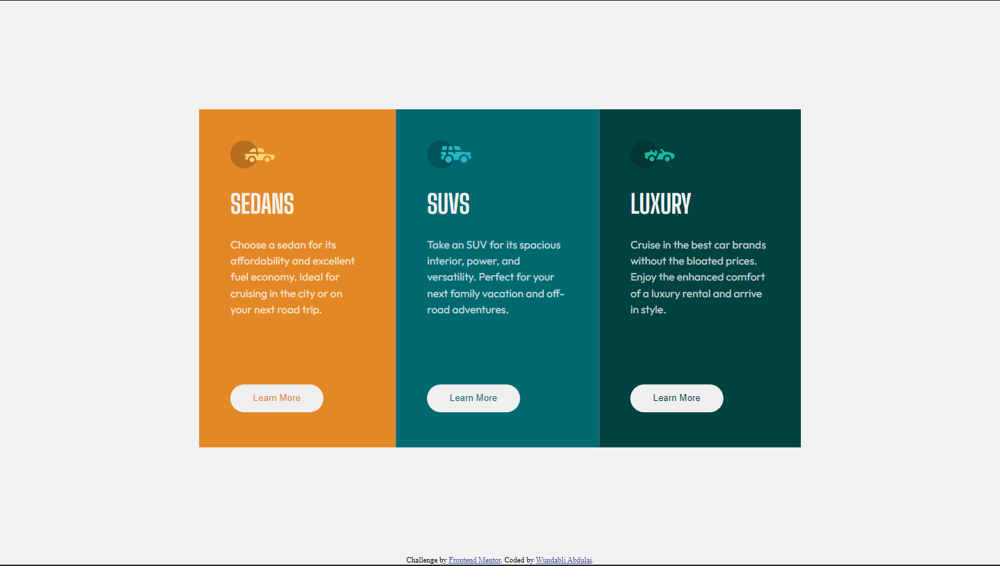

# Frontend Mentor - 3-column preview card component solution

This is a solution to the [3-column preview card component challenge on Frontend Mentor](https://www.frontendmentor.io/challenges/3column-preview-card-component-pH92eAR2-). Frontend Mentor challenges help you improve your coding skills by building realistic projects. 

## Table of contents

- [Overview](#overview)
  - [The challenge](#the-challenge)
  - [Screenshot](#screenshot)
  - [Links](#links)
- [My process](#my-process)
  - [Built with](#built-with)
  - [What I learned](#what-i-learned)
  - [Continued development](#continued-development)
  - [Useful resources](#useful-resources)
- [Author](#author)

## Overview

### The challenge

Users should be able to:

- View the optimal layout depending on their device's screen size
- See hover states for interactive elements

### Screenshot

### Links

- Solution URL: [Add solution URL here](https://github.com/wundaab/3-column-preview-card/tree/main)
- Live Site URL: [Add live site URL here](https://merry-sopapillas-9b7354.netlify.app/)

## My process

### Built with

- Semantic HTML5 markup
- Flexbox

### What I learned
 I got better at using Google Fonts

### Continued development

-Margin
-Flexbox

### Useful resources

- [Resource 1](https://www.w3schools.com/) - My go-to for HTML and CSS syntax that i've forgotten.

## Author

- Website - [Wundabli Abdulai](https://www.your-site.com)
- Frontend Mentor - [@wundaab](https://www.frontendmentor.io/profile/wundaab)
- Twitter - [@asdfghjklcol](https://www.twitter.com/asdfghjklcol)
